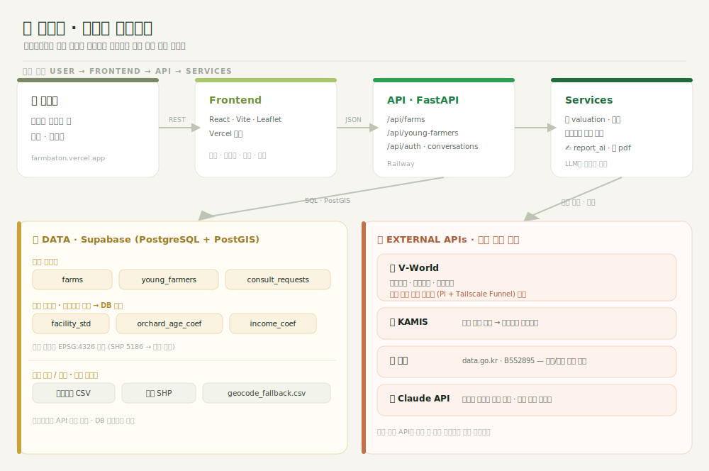
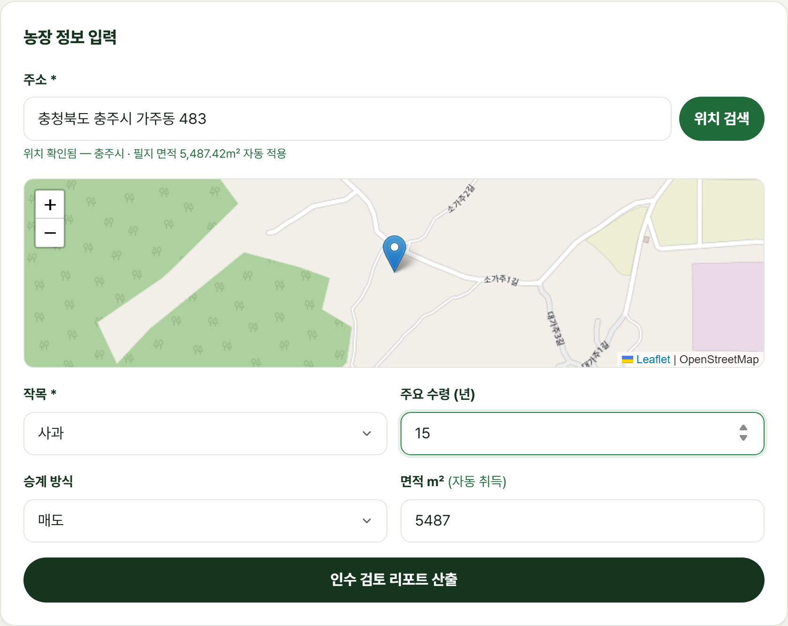
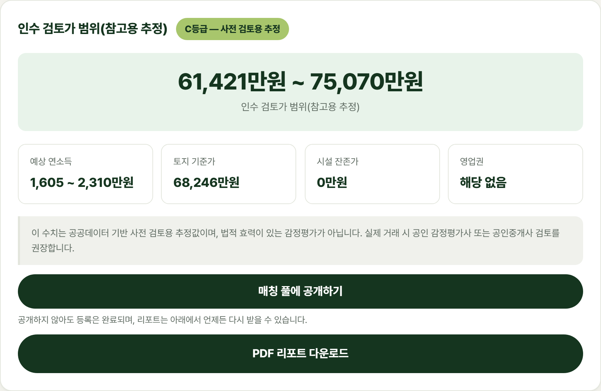
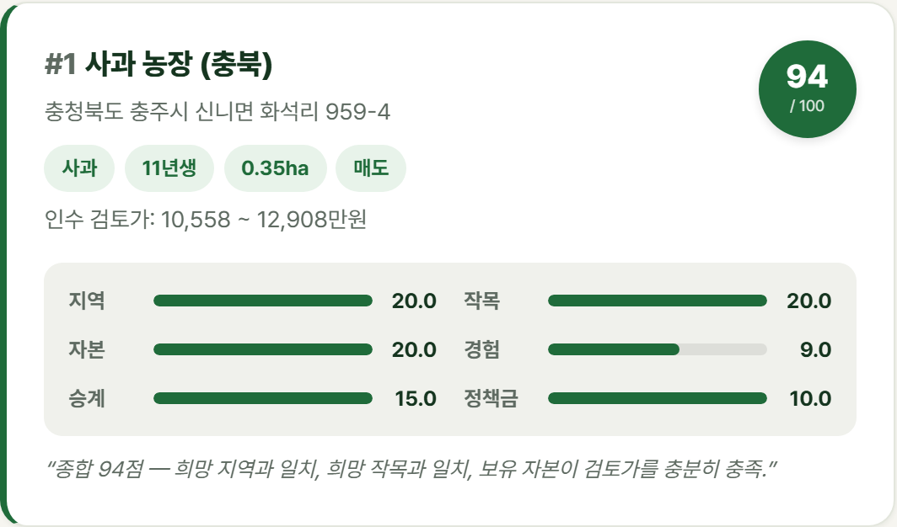

<div align="center">


# 팜바톤 (FarmBaton)

**고령 농가의 농장(농지·작목·시설·판로)을 청년농에게 잇는 승계 진단·매칭 플랫폼**

제11회 농업·농촌 공공데이터 + AI 활용 창업경진대회 출품작

[](https://farmbaton.vercel.app)
[](https://www.youtube.com/watch?v=GtnSmSwezYI)


[**라이브 데모 →**](https://farmbaton.vercel.app) · [**시연 영상 →**](https://www.youtube.com/watch?v=GtnSmSwezYI)

</div>

---

## 한 줄 소개

은퇴를 앞둔 고령 농가의 **농장 가치를 공공데이터로 자동 진단**하고, 그 농장을 이어받을
**청년농을 조건 기반으로 매칭**합니다. "사라지던 농장을 다음 세대에 잇는다"가 목표입니다.

- **지역**: 충북 · 경북 · 충남 3개 도
- **작목**: 사과 · 복숭아 · 포도 (과수 3종)
- **핵심 플로우 2종**
  1. 🌾 **농가** — 농장 등록 → **인수 검토 리포트**(가치 진단 + PDF)
  2. 🧑‍🌾 **청년농** — 프로필 등록 → **조건 기반 매칭 리스트**

---

## 시스템 아키텍처

<div align="center">
  
</div>

---

## 화면

| 농장 등록 | 인수 검토 리포트 | 청년농 매칭 |
| :---: | :---: | :---: |
|  |  |  |

> 데모 계정으로 [farmbaton.vercel.app](https://farmbaton.vercel.app)에서 직접 체험할 수 있습니다.

---

## 핵심 산식

평가 로직의 단일 진실 원천은 [`docs/formula.md`](docs/formula.md)이며, 기준 단가·계수는
**코드 하드코딩 없이 DB 테이블**(`facility_std`, `orchard_age_coef`, `income_coef` …)을 참조합니다.

```
예상 연소득   = 10a당 평균소득 × 면적(10a) × 수령계수 × 시세보정(KAMIS)
시설 잔존가   = 표준단가 × 면적 × max(잔존가율, 1 − 경과연수/내용연수) × 상태등급
인수 검토가   = 토지 기준가(공시지가×면적, 실거래 보정) + 시설 잔존가 + 영업권
범위(min~max)   (영업권 = 자료 제출 시 순소득 × 1~2배)
```

> 결과는 항상 **min/max 범위**로 산출하며, 단일 감정 금액으로 표기하지 않습니다.

---

## 기술 스택

| 영역 | 기술 |
| --- | --- |
| **프런트엔드** | React 19 · Vite · React Router · Leaflet (모바일 퍼스트 반응형) · Vercel |
| **백엔드** | FastAPI · Python 3 · Playwright(PDF) · Railway |
| **데이터베이스** | PostgreSQL + PostGIS (Supabase) |
| **AI** | Claude API — 리포트 설명문 생성 전용 |
| **외부 데이터** | 팜맵(B552895) · V-World · KAMIS · 실거래가 CSV · 농산물소득조사 |

---

## 디렉터리 구조

```
farmbaton/
├─ backend/
│  ├─ app/
│  │  ├─ routers/      # auth · farms · young_farmers · chat
│  │  ├─ services/     # valuation · report_ai · pdf_render · db_loader · auth
│  │  ├─ templates/    # PDF 리포트 템플릿
│  │  └─ main.py       # FastAPI 진입점 (CORS · 지오코딩 폴백)
│  └─ tests/           # pytest (가치평가 엔진 테스트 우선)
├─ frontend/src/       # 페이지 · 컴포넌트 · API 클라이언트
├─ etl/                # 1회성 적재 스크립트 (SHP, CSV)
├─ db/seed/            # 기준 테이블 CSV · seed SQL · 지오코딩 폴백
├─ proxy/              # V-World 국내 우회 프록시 (Pi + Tailscale)
└─ docs/formula.md     # 가치평가 산식 확정본 (단일 진실 원천)
```

---

## 로컬 실행

**백엔드**

```bash
pip install -r requirements.txt
playwright install chromium          # PDF 리포트(/api/farms/{id}/report.pdf)에 1회 필요
uvicorn backend.app.main:app --reload
```

**프런트엔드**

```bash
cd frontend
npm install
npm run dev                          # http://localhost:5173
```

환경변수는 [`.env.example`](.env.example)을 참고하세요. Supabase · V-World · KAMIS ·
Claude 키가 필요하며, **키가 없어도 정적 폴백으로 데모가 동작**합니다.

---

## 배포

| 구성 | 위치 |
| --- | --- |
| 프런트엔드 | Vercel — https://farmbaton.vercel.app |
| 백엔드 | Railway — `https://backend-production-a7818.up.railway.app` |
| DB | Supabase (PostgreSQL/PostGIS) |
| V-World 우회 프록시 | 국내 회선 기기 + Tailscale Funnel ([proxy/README.md](proxy/README.md)) |

---

<div align="center">

**공공데이터와 AI로, 사라지던 농장을 다음 세대에 잇습니다.**

팀 김정훈 · 윤채원 · 유수민

</div>
